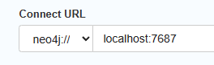

# Dataset for: Design Pattern Representation and Detection based on Heterogeneous Information Network

## 1 Structure of the Dataset

### a. HINs

* jhotdraw.db.dump
* junit.db.dump
* quickuml.db.dump
* tested_systems_source_code.zip
* Attributes of entities in HIN.md
* Catalog of MSs.pdf
* Catalog of DPs.pdf

### b. Detection

* cypher.md
* dp_cypher_with_methods.py
* dp_cypher_without_methods.py
* run.ipynb

### c. Results

* Evaluation Results.xlsx
* jhotdraw(with_methods).xlsx
* jhotdraw(without_methods).xlsx
* junit(with_methods).xlsx
* junit(without_methods).xlsx
* quickuml(with_methods).xlsx
* quickuml(without_methods).xlsx
* P-MARt.xls
* Xiong et.al dataset.pdf

> The difference between "with_methods" files and "without_methods" files is the number of detection DP instances.

### d. Prototype tool for parsing

* java_dpd.zip
* py2neo_dpd.zip

## 2 How to Use the Data?

### View results

`c.Results/Evaluation Results.xlsx` shows the main result compared with other DPD tools.

`P-MARt.xls` is download from https://www.ptidej.net/tools/designpatterns/index_html/

> Yann-Gaël Guéhéneuc. (2007). P-MARt : Pattern-like Micro Architecture Repository. ..

`Xiong et.al dataset.pdf` is download from https://github.com/Megre/Dataset4SparT

> Xiong, R., & Li, B. (2019). Accurate Design Pattern Detection Based on Idiomatic Implementation Matching in Java Language Context. 2019 IEEE 26th International Conference on Software Analysis, Evolution and Reengineering (SANER). https://doi.org/10.1109/saner.2019.8668031

### Repeated experiment

> JDK  version: 11

#### Load data

##### Method 1: Use database dumps

`a.HINs` offers neo4j dump files of the tested three open systems. `Neo4j-community` must be downloaded first from [Neo4j Download Center - Graph Database & Analytics](https://neo4j.com/download-center/#community), our version is `4.4.19`. And then execute the following codes to start a neo4j instance:

```bash
cd neo4j-community/bin
./neo4j-admin load --from=xxx\Dataset4HIN-DPD-master\a.HINs\xxx.db.dump
./neo4j console
```

You may need to edit the file `neo4j-community/conf/neo4j.conf` to ensure support for `neo4j Brower`.

Add the following code to `neo4j.conf`:

```bash
dbms.security.auth_enabled=false
```

##### Method 2: Create databases yourself

You can also create graph database data yourself by running `d.Prototype tool for parsing`.

`java_dpd.zip` provides the source code corresponding to the **code parsing and representation** stage. It is a Java-based project developed by Idea Environment. This project has been tested on the three systems mentioned in the paper. To be clear, this is a prototype tool and its applicability needs to be further validated.

The basic POJO classes are as shown:


This tool uses SPOON ([SPOON](https://github.com/INRIA/spoon)) to build the AST, and you can also use other AST parsing tools and work on other programming languages since the whole MS catalog and DP decomposing formulas have been given.

> Pawlak, R., Monperrus, M., Petitprez, N., Noguera, C., Seinturier, L.: Spoon: A Library for Implementing Analyses and Transformations of Java Source Code. Software: Practice and Experience 46, 1155–1179 (2015). https://doi.org/10.1002/spe.2346, https://hal.archives-ouvertes.fr/ hal-01078532/document

**usage**:

1. Change the specific **path** of the target system in `com.exapmle.App.java`
2. Change the **host and port** of the neo4j brower in `resources/neo4j.properties`
3. Run the **main** method of `com.exapmle.App.java`, then the embedded neo4j instance will start automatically (through bolt protocol) after code parsing.
4. open the neo4j brower by

```bash
cd neo4j-community/bin
./neo4j console
```


#### Get results

After neo4j instance started ,there are two ways to get results.

##### Method 1: Neo4j Brower

Open http://localhost:7474/, the default user_name and password are `neo4j` and `neo4j`(or `123456`).

If you use database dumps, then set the Connect URL of the neo4j brower as follows:



If you create databases yourself, then set the Connect URL of the neo4j brower according to `resources/neo4j.properties` as follows:


Press the `Connect` button.


Then run normal Cypher statements, or predefined statements in `b.Detection/cypher.md`. 

**Example 1**: For the simple target system `invoke` (5 classes), if you send:

```cypher
MATCH (n) RETURN n
```

then you can get:


**Example 2**: For the target system `junit 3.7`, if you send the Cypher statement for matching factory method pattern instances:

```cypher
MATCH
	TMM_TM_TT=(ConcreteCreator:Type)-[:has_method]->(factoryMethodImpl:Method)-[:overrides|implements*..]->(factoryMethod:Method)<-[:has_method]-(Creator:Type)<-[:inherits*..]-(ConcreteCreator:Type),
    MT1=(factoryMethodImpl:Method)-[:actual_return]->(ConcreteProduct:Type),
    MT2=(factoryMethod:Method)-[:return]->(Product:Type),
    TT=(ConcreteProduct:Type)-[:inherits*..]->(Product:Type)
RETURN DISTINCT
	Creator.qualifiedName as Creator,
	ConcreteCreator.qualifiedName as ConcreteCreator,
    Product.qualifiedName as Product,
    ConcreteProduct.qualifiedName as ConcreteProduct
ORDER BY
	Creator.qualifiedName,ConcreteCreator.qualifiedName,Product.qualifiedName
```

or

```bash
MATCH
	TMM_TM_TT=(ConcreteCreator:Type)-[:has_method]->(factoryMethodImpl:Method)-[:overrides|implements*..]->(factoryMethod:Method)<-[:has_method]-(Creator:Type)<-[:inherits*..]-(ConcreteCreator:Type),
    MT1=(factoryMethodImpl:Method)-[:actual_return]->(ConcreteProduct:Type),
    MT2=(factoryMethod:Method)-[:return]->(Product:Type),
    TT=(ConcreteProduct:Type)-[:inherits*..]->(Product:Type)
RETURN
	Creator,
	ConcreteCreator,
    Product,
    ConcreteProduct,
    factoryMethodImpl,
    factoryMethod
```

then you can get:


or


> This method is semi-automatic with a has a good visualization effect, you can replace fields with specific relations to view instance graphs.


##### Method 2: Juphter

Start JupyterLab or JupyterNotebook, create a project with files in `d. Prototype tool for parsing/py2neo_dpd.zip`, and execute the file `run.ipynb`.

As a result, you can get the following files:

* jhotdraw(with_methods).xlsx
* jhotdraw(without_methods).xlsx
* junit(with_methods).xlsx
* junit(without_methods).xlsx
* quickuml(with_methods).xlsx
* quickuml(without_methods).xlsx

Or you can execute the file `print.ipynb` to view interaction results.


### Match new patterns

You can define your patterns and decompose them into micro-structures, and then code related Cypher statements to match their instances in the HIN.
